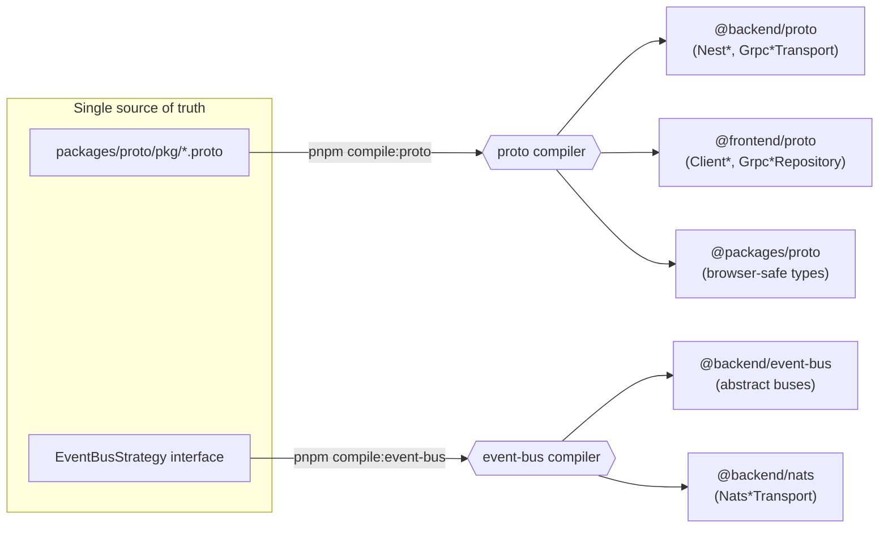
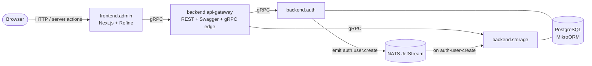

<h1 align="center">base</h1>

<p align="center">
  Personal-website monorepo — hexagonal <strong>NestJS gRPC microservices</strong> and a
  <strong>Next.js / Refine admin panel</strong>, wired together by custom
  <strong>Protobuf</strong> and <strong>NATS JetStream</strong> codegen pipelines.
</p>

<p align="center">
  
  
  
  
  
</p>

<p align="center">
  
  
  
  
  
  
  
  
  
</p>

### Architecture at a glance

The `.proto` contracts and the `EventBusStrategy` interface are the two sources of truth.
Custom compilers fan them out into typed gRPC clients/controllers and a typed NATS event bus,
so every cross-service call and every event is statically checked end-to-end.

**Codegen pipelines** — one contract, many generated targets:



**Runtime topology** — gRPC for request/response, NATS JetStream for domain events:



- **api-gateway** terminates external REST/Swagger traffic and re-exposes gRPC to the admin panel, proxying to internal services.
- **auth** is the reference hexagonal service (`domain` → `application` → `infrastructure` → `interface`); **storage** follows the same shape and consumes auth events over NATS.
- Delivery is at-least-once (`manualAck`, `maxDeliver: 10`) — event subscribers are idempotent.

### Requirements

- Node.js 22.22.0+
- pnpm 11.9.0
- Installed `protobuf` compiler (for development and gRPC compiler only)
- Installed `docker` and `docker compose` (optional)

### Current tech stack

> Project
>
> - Turborepo + pnpm workspaces
> - TypeScript
> - Protobuf / gRPC (custom codegen)

> Admin panel
>
> - Next.js
> - Refine
> - Material UI

> Backend
>
> - Nest.js
> - gRPC microservices (hexagonal / use-case architecture)
> - MikroORM + PostgreSQL
> - NATS JetStream (typed event bus, custom codegen)

### Project structure

```shell
backend/ # directory for backend stuff
  apps/
    ...backend services (backend.*)
  packages/
    ...backend packages (@backend/*)
frontend/ # directory for frontend stuff
  apps/
    ...frontend services (frontend.*)
  packages/
    ...frontend packages (@frontend/*)
packages/ # directory for common shared packages
  ...common packages (@packages/*)
turbo/
  generators/ # directory with custom code generators
```

### Environment variables

Environment variables should be placed in service-specific `.env` files:

```handlebars
/ .env (env file for docker-compose.yml) backend/ apps/{{backend service name}}/ .env frontend/
apps/{{frontend service name}}/ .env
```

You can check examples of env variables in service-specific `.env.example` files

### Usage

```shell
git clone git@github.com:yauheni-shcharbakou/base.git
cd base
pnpm install
```

##### Commands for run in development mode

```shell
pnpm dev
pnpm dev:backend # only backend stuff
pnpm dev:frontend # only frontend stuff
```

##### Commands for packages compilation

```shell
pnpm compile
pnpm compile:proto # run proto compiler
pnpm compile:event-bus # run event-bus compiler
```

##### Commands for build

```shell
pnpm build
pnpm build:backend # only backend stuff
pnpm build:frontend # only frontend stuff
pnpm build:proto # only proto compiler packages
```

##### Commands for run in production mode

```shell
pnpm prod
pnpm prod:backend # only backend stuff
```

##### Commands for run in docker

```shell
pnpm docker # start all services (production mode)
pnpm docker:local # start only transport services (local development mode)
```

##### Commands for reset build caches:

```shell
pnpm reset
pnpm reset:backend # only backend services
pnpm reset:frontend # only frontend services
```

##### Commands for reset node_modules:

```shell
pnpm reset:modules
```

##### For format project with prettier run:

```shell
pnpm format
```

### Code generation

For generate new package run:

```shell
pnpm gen:package
```

### Security audit

For check deps vulnerabilities run:

```shell
pnpm audit
```
