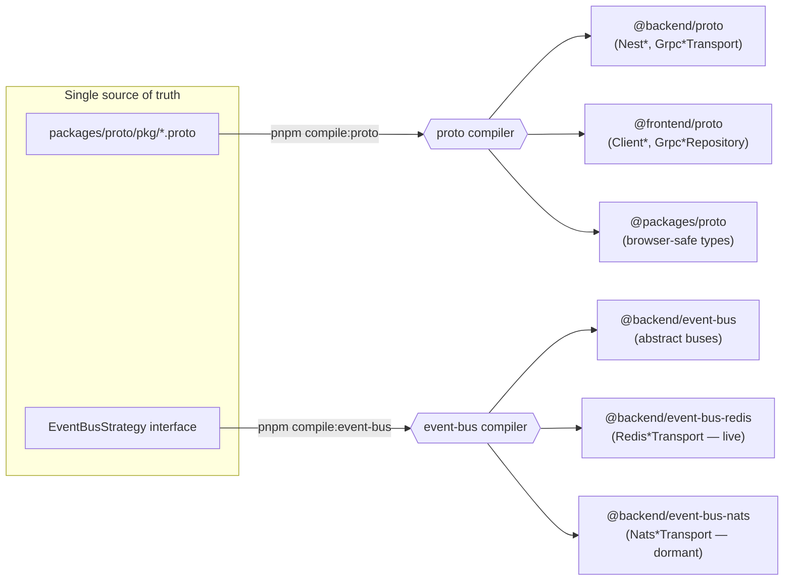
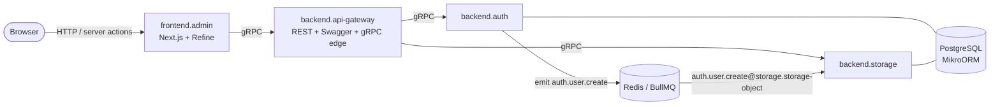

<h1 align="center">base</h1>

<p align="center">
  Personal-website monorepo — hexagonal <strong>NestJS gRPC microservices</strong> and a
  <strong>Next.js / Refine admin panel</strong>, wired together by custom
  <strong>Protobuf</strong> and <strong>event-bus</strong> codegen pipelines.
</p>

<p align="center">
  
  
  
  
  
</p>

<p align="center">
  
  
  
  
  
  
  
  
  
</p>

### Architecture at a glance

The `.proto` contracts and the `EventBusStrategy` interface are the two sources of truth.
Custom compilers fan them out into typed gRPC clients/controllers and a typed event bus,
so every cross-service call and every event is statically checked end-to-end.

**Codegen pipelines** — one contract, many generated targets:


```mermaid
flowchart LR
  subgraph Contracts["Single source of truth"]
    P["packages/proto/pkg/*.proto"]
    E["EventBusStrategy interface"]
  end

  P -->|pnpm compile:proto| PC{{proto compiler}}
  PC --> BP["@backend/proto<br/>(Nest*, Grpc*Transport)"]
  PC --> FP["@frontend/proto<br/>(Client*, Grpc*Repository)"]
  PC --> PKP["@packages/proto<br/>(browser-safe types)"]

  E -->|pnpm compile:event-bus| EC{{event-bus compiler}}
  EC --> EB["@backend/event-bus<br/>(abstract buses)"]
  EC --> RA["@backend/event-bus-redis<br/>(Redis*Transport — live)"]
  EC --> NA["@backend/event-bus-nats<br/>(Nats*Transport — dormant)"]
```

**Runtime topology** — gRPC for request/response, Redis/BullMQ for domain events:


```mermaid
flowchart LR
  Browser(["Browser"])
  Browser -->|"HTTP / server actions"| Admin["frontend.admin<br/>Next.js + Refine"]
  Admin -->|gRPC| GW["backend.api-gateway<br/>REST + Swagger + gRPC edge"]

  GW -->|gRPC| Auth["backend.auth"]
  GW -->|gRPC| Storage["backend.storage"]

  Auth -->|"emit auth.user.create"| Redis[("Redis / BullMQ")]
  Redis -->|"auth.user.create@storage.storage-object"| Storage

  Auth --- PG[("PostgreSQL<br/>MikroORM")]
  Storage --- PG
```

- **api-gateway** terminates external REST/Swagger traffic and re-exposes gRPC to the admin panel, proxying to internal services.
- **auth** is the reference hexagonal service (`domain` → `application` → `infrastructure` → `interface`); **storage** follows the same shape and consumes auth events over the event bus.
- An event queue is fanned out by a mediator into one queue per subscriber, so several services can consume the same event despite BullMQ being a work queue.
- Delivery is at-least-once (`attempts: 10`, exponential backoff) — event subscribers are idempotent.
- The bus is broker-agnostic: the same `EventBusStrategy` also generates a NATS JetStream adapter (`@backend/event-bus-nats`), currently dormant. It scopes subscriptions by consumer id the same way, but needs no mediator — JetStream fans an event out to one durable consumer per subscriber on its own.

### Requirements

- Node.js 22.22.0+
- pnpm 11.9.0
- Installed `protobuf` compiler (for development and gRPC compiler only)
- Installed `docker` and `docker compose` (optional)

### Current tech stack

> Project
>
> - Turborepo + pnpm workspaces
> - TypeScript
> - Protobuf / gRPC (custom codegen)

> Admin panel
>
> - Next.js
> - Refine
> - Material UI

> Backend
>
> - Nest.js
> - gRPC microservices (hexagonal / use-case architecture)
> - MikroORM + PostgreSQL
> - Redis + BullMQ (typed event bus, custom codegen; NATS JetStream adapter kept as an alternative)

### Project structure

```shell
backend/ # directory for backend stuff
  apps/
    ...backend services (backend.*)
  packages/
    ...backend packages (@backend/*)
frontend/ # directory for frontend stuff
  apps/
    ...frontend services (frontend.*)
  packages/
    ...frontend packages (@frontend/*)
packages/ # directory for common shared packages
  ...common packages (@packages/*)
turbo/
  generators/ # directory with custom code generators
```

### Environment variables

Environment variables should be placed in service-specific `.env` files:

```handlebars
/ .env (env file for docker-compose.yml) backend/ apps/{{backend service name}}/ .env frontend/
apps/{{frontend service name}}/ .env
```

You can check examples of env variables in service-specific `.env.example` files

#### JWT keys

Access tokens are signed with **RS256**: `backend.auth` holds the private key and issues them, `backend.api-gateway` holds only the public key and verifies them locally (this is what lets the gRPC stream guard stay synchronous). Refresh tokens stay HS256 and never leave `backend.auth`.

Generate the pair and copy the two lines into your `.env` files:

```shell
openssl genpkey -algorithm RSA -pkeyopt rsa_keygen_bits:2048 -out jwt-access.key && openssl rsa -in jwt-access.key -pubout -out jwt-access.key.pub && echo "JWT_ACCESS_PRIVATE_KEY_BASE64=$(base64 -i jwt-access.key | tr -d '\n')" && echo "JWT_ACCESS_PUBLIC_KEY_BASE64=$(base64 -i jwt-access.key.pub | tr -d '\n')"
```

The keys are base64-encoded on purpose: a multi-line PEM does not survive `.env` files, docker-compose inline variables, or Railway.

- `backend/apps/auth/.env` — both variables
- `backend/apps/api-gateway/.env` — `JWT_ACCESS_PUBLIC_KEY_BASE64` only
- root `.env` — both (docker-compose forwards them)

On **Railway**, set them per service before redeploying (`validateEnv` fails fast on startup otherwise): the private key on `backend.auth`, the public key on both `backend.auth` and `backend.api-gateway`. Declaring the public key as a project-level shared variable and referencing it via `${{shared.JWT_ACCESS_PUBLIC_KEY_BASE64}}` keeps the two services from drifting apart. Rotating the pair invalidates every issued access token — clients recover through the refresh flow.

#### Redis on Railway

Add the managed **Redis** database to the project and point both event-bus services at it with a
reference variable — `REDIS_URL=${{Redis.REDIS_PRIVATE_URL}}` on `backend.auth` and `backend.storage`.
Use the *private* URL: the public one goes through a TCP proxy, which costs egress on every blocking
command a BullMQ worker issues.

Railway's private network (`*.railway.internal`) is IPv6-only in environments created before
2025-10-16, while ioredis looks up an A record by default and fails with `ENOTFOUND`. The adapter
therefore defaults to dual-stack lookups (`REDIS_IP_FAMILY=0`); set it to `6` if reconnects turn out
flaky. Also keep the instance on `maxmemory-policy noeviction` — with eviction enabled Redis may drop
a queue key and lose jobs.

### Usage

```shell
git clone git@github.com:yauheni-shcharbakou/base.git
cd base
pnpm install
```

##### Commands for run in development mode

```shell
pnpm dev
pnpm dev:backend # only backend stuff
pnpm dev:frontend # only frontend stuff
```

##### Commands for packages compilation

```shell
pnpm compile
pnpm compile:proto # run proto compiler
pnpm compile:event-bus # run event-bus compiler
```

##### Commands for build

```shell
pnpm build
pnpm build:backend # only backend stuff
pnpm build:frontend # only frontend stuff
pnpm build:proto # only proto compiler packages
```

##### Commands for run in production mode

```shell
pnpm prod
pnpm prod:backend # only backend stuff
```

##### Commands for run in docker

```shell
pnpm docker # start all services (production mode)
pnpm docker:local # start only transport services (local development mode)
pnpm docker:db # start only Postgres and Redis, detached
pnpm docker:db:stop # stop them
pnpm docker:e2e # start every server the e2e suites need (Postgres, Redis, NATS), detached
pnpm docker:e2e:stop # stop them
pnpm e2e # start them, run every e2e suite with no skip allowed, stop them
```

##### Commands for reset build caches:

```shell
pnpm reset
pnpm reset:backend # only backend services
pnpm reset:frontend # only frontend services
```

##### Commands for reset node_modules:

```shell
pnpm reset:modules
```

##### For format project with prettier run:

```shell
pnpm format
```

### Code generation

For generate new package run:

```shell
pnpm gen:package
```

### Security audit

For check deps vulnerabilities run:

```shell
pnpm audit
```
